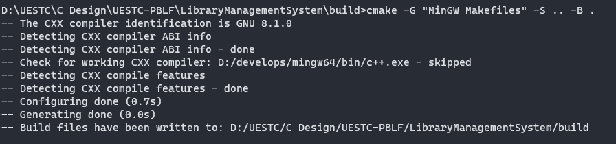
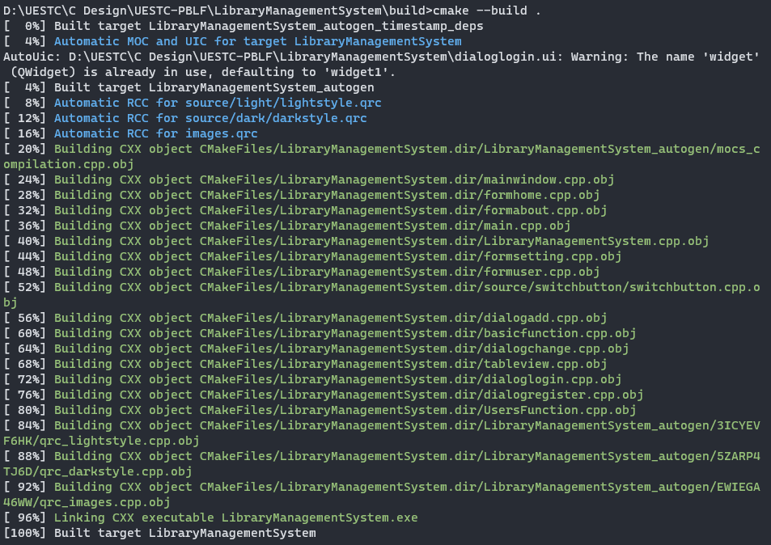

<h1 align="center">🤺UESTC-PBLF🤺</h1>

<p align='center'>🏫电子科技大学</p>
<p align='center'>🧑‍💻程序设计项目实践（PBFL）作品</p>

<p align='center'>📚图书馆管理系统</p>

<p align="center">
  
  
</p>


## 📦外部库

> 🥸cJSON：[DaveGamble/cJSON: Ultralightweight JSON parser in ANSI C (github.com)](https://github.com/DaveGamble/cJSON)
>
> 🥸Switch Button：[Qt编写自定义控件一开关按钮 - 飞扬青云 - 博客园 (cnblogs.com)](https://www.cnblogs.com/feiyangqingyun/p/6035633.html)
>
> 🥸QDarkStyleSheet：[ColinDuquesnoy/QDarkStyleSheet: A dark style sheet for QtWidgets application (github.com)](https://github.com/ColinDuquesnoy/QDarkStyleSheet)

## ▶️使用

打开目录中Deploy文件夹，双击运行应用程序`LibraryManagementSystem.exe`。

## ⛏️构建

### 先决条件

在开始之前，请确保您的计算机满足以下要求：

- Windows 11/10操作系统
- 至少4GB的RAM
- 至少10GB的可用硬盘空间


### 安装步骤

#### 安装Qt

1. 访问 [Qt官方网站](https://www.qt.io/download) 并下载Qt安装程序。
2. 运行安装程序，选择Qt 5。
3. 安装过程中，选择“Desktop gcc”（或相应的编译器）。

#### 安装CMake

1. 访问 [CMake官方网站](https://cmake.org/download/) 并下载CMake安装程序。
2. 安装CMake，并确保在安装过程中将CMake添加到系统路径。

#### 安装MinGW（如果使用GCC编译器）

1. 访问 [MinGW-w64](https://mingw-w64.org) 或 [MinGW-w64 at SourceForge.net](https://sourceforge.net/projects/mingw-w64/files/mingw-w64/mingw-w64-release/)。
2. 下载并安装适合您系统的MinGW版本。
3. 在安装过程中，确保将MinGW添加到系统路径。

### 编译项目

1. 打开命令提示符或终端。
2. 导航到项目源代码所在的文件夹。
3. 运行以下命令来配置项目：

```shell
# 以下命令在CMakeLists.txt所在路径操作

mkdir build
cd build
cmake -G "MinGW Makefiles" -S .. -B .
```



```cmake
cmake --build .
```



最后，手动把`LibrarySystemInfo.json`,`UsersInfo.json`,`AutoSaveInfo.json`拷贝到`/json`目录

## 运行应用程序

1. 在 `./build` 目录下，找到编译好的可执行文件。
2. 双击运行应用程序`LibraryManagementSystem.exe`。

## 常见问题解决

- 如果遇到任何编译错误，请检查Qt和MinGW是否正确安装，并且版本是否兼容。
- 确保所有步骤都按照指南执行。

## 更多帮助

如果您在构建或运行过程中遇到问题，请参阅 [Qt文档](https://doc.qt.io/) 或 [CMake文档](https://cmake.org/documentation/)。

